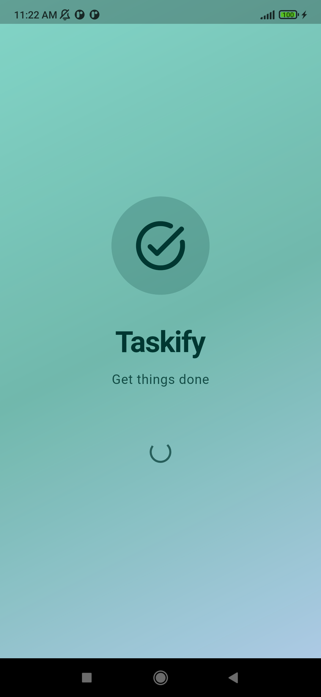
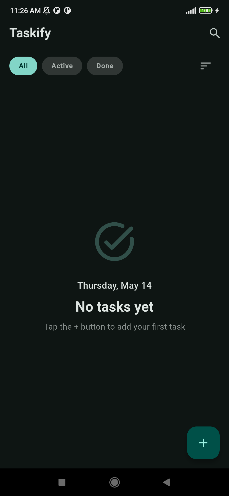
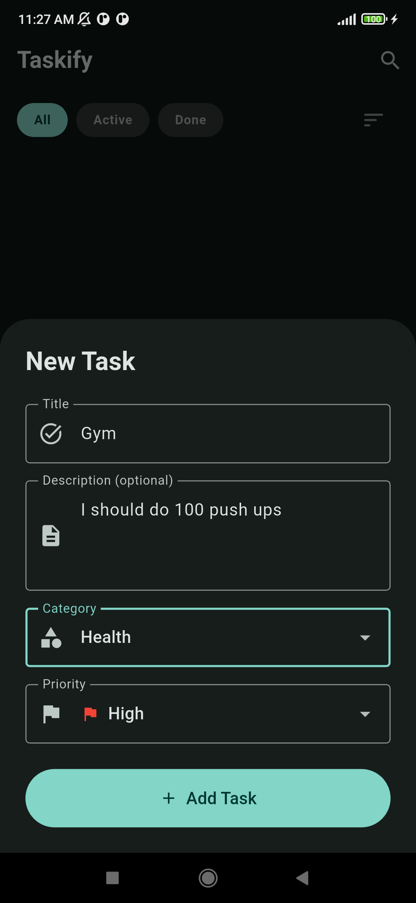
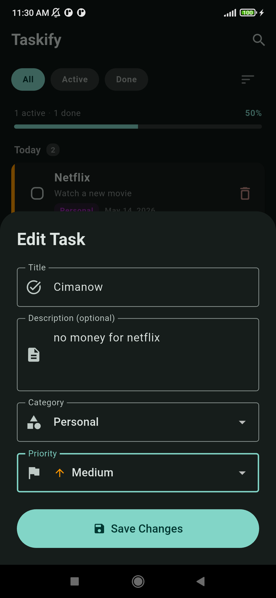
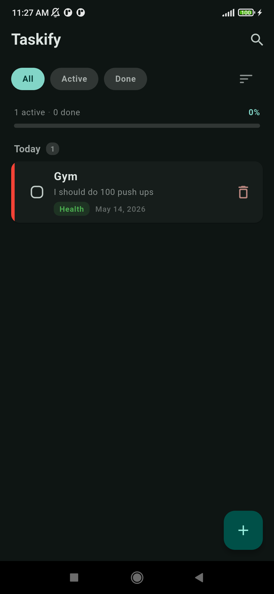
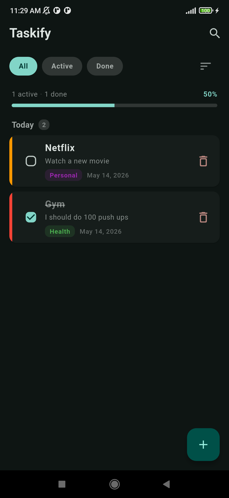

<div align="center">
  
  <h1>Taskify</h1>
  <p>A beautiful, feature-rich todo app built with Flutter</p>
  <p>
    
    
    
    
  </p>
</div>

---

## Features

- **Create, edit, and delete tasks** with an intuitive interface
- **Priority levels** — High (red), Medium (orange), Low (green) with colored bars
- **Categories** — General, Work, Personal, Shopping, Health, Learning
- **Search** — Find tasks instantly by title or description
- **Filter** — All, Active, or Done tasks
- **Sort** — Newest, Oldest, Name, Active first, Priority
- **Date grouping** — Tasks automatically grouped into Today, Yesterday, This Week, and Monthly sections
- **Progress tracking** — Visual progress bar with completion percentage
- **Swipe to delete** with undo snackbar
- **Dark mode** — Automatically follows system theme
- **Offline-first** — All data stored locally with Hive

## Screenshots

<div align="center">
  <table>
    <tr>
      <td align="center"><strong>Home</strong></td>
      <td align="center"><strong>Add Task</strong></td>
      <td align="center"><strong>Edit Task</strong></td>
    </tr>
    <tr>
      <td></td>
      <td></td>
      <td></td>
    </tr>
    <tr>
      <td align="center"><strong>Tasks</strong></td>
      <td align="center"><strong>Complete</strong></td>
      <td align="center"><strong>Splash</strong></td>
    </tr>
    <tr>
      <td></td>
      <td></td>
      <td></td>
    </tr>
  </table>
</div>

## Tech Stack

| Technology | Purpose |
|------------|---------|
| **Flutter** | UI framework |
| **Hive** | Local on-device storage |
| **Material 3** | Design system |
| **uuid** | Unique task IDs |
| **intl** | Date formatting |

## Project Structure

```
lib/
├── main.dart                  # Entry point, Hive initialization
├── app.dart                   # MaterialApp with theme config
├── models/
│   └── todo.dart              # Todo model with Priority enum
├── screens/
│   ├── splash_screen.dart     # Animated splash screen
│   └── home_screen.dart       # Main screen with list, filters, search
├── widgets/
│   ├── add_todo_sheet.dart    # Bottom sheet form for add/edit
│   └── todo_tile.dart         # Individual task card widget
├── services/
│   └── todo_service.dart      # Hive CRUD operations
└── theme/
    └── app_theme.dart         # Light/dark theme definitions
```

## Getting Started

### Prerequisites

- Flutter SDK 3.11+ ([install guide](https://docs.flutter.dev/get-started/install))
- Dart 3.11+

### Installation

```bash
# Clone the repository
git clone <your-repo-url>
cd training_day

# Install dependencies
flutter pub get

# Run the app
flutter run
```

### Build for release

```bash
# Android APK
flutter build apk --release

# iOS
flutter build ios --release
```

## License
Feras AlJazzar
This project is for educational purposes.
